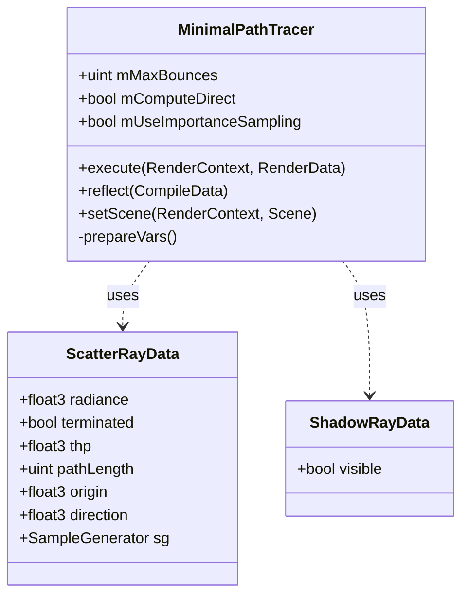
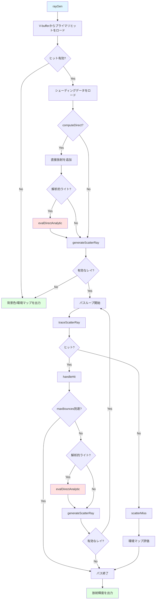

# MinimalPathTracer レンダーパス技術ドキュメント

## 概要

MinimalPathTracerは、Falcorフレームワークにおけるシンプルで教育的なリファレンス実装のパストレーサーです。意図的に高度な最適化技術を排除し、可能な限りナイーブな実装を保つことで、他のレンダラーの検証用グラウンドトゥルースを生成することを目的としています。

**設計思想:**
- **シンプル性:** 理解しやすく、デバッグしやすい実装
- **検証用途:** より複雑なレンダラーの正確性検証
- **不偏性:** バイアスのない一貫した結果を提供
- **教育目的:** パストレーシングの基本概念の学習

**主要な特徴:**
- ブルートフォース型パストレーシング
- 解析的ライト、放射ジオメトリ、環境マップのサポート
- オプショナルなマテリアル重点サンプリング
- 固定パス長による単純なトラバーサル制御

**制限事項:**
- 透過と入れ子誘電体は未サポート
- Next-Event Estimation (NEE) なし
- Multiple Importance Sampling (MIS) なし
- Russian Roulette なし
- デノイザー用データ出力なし

## アーキテクチャ

### クラス構造



### 主要コンポーネント

#### 1. MinimalPathTracer (C++側)
レンダーパスの制御とシェーダープログラムの管理を担当します。

**ファイル:** [MinimalPathTracer.cpp](Source/RenderPasses/MinimalPathTracer/MinimalPathTracer.cpp), [MinimalPathTracer.h](Source/RenderPasses/MinimalPathTracer/MinimalPathTracer.h)

**主要な責務:**
- レイトレーシングプログラムのセットアップ
- シーン変更時のプログラム再構築
- 静的パラメータによるシェーダー特殊化
- V-bufferからの実行

#### 2. レイトレーシングシェーダー
全てのパストレーシングロジックを含む単一のシェーダーファイルです。

**ファイル:** [MinimalPathTracer.rt.slang](Source/RenderPasses/MinimalPathTracer/MinimalPathTracer.rt.slang)

**シェーダーエントリーポイント:**
- `rayGen()`: レイジェネレーションシェーダー - ピクセルごとにパスをトレース
- `scatterMiss()`: スキャッターレイのミスシェーダー - 環境マップを評価
- `shadowMiss()`: シャドウレイのミスシェーダー - 可視性を記録
- `scatterTriangleMeshClosestHit()`: トライアングルヒット処理
- `scatterTriangleMeshAnyHit()`: アルファテスト
- その他ジオメトリタイプ別のヒットシェーダー

#### 3. ペイロード構造

**ScatterRayData** - スキャッターレイの状態（最大72バイト）
- `radiance`: 累積放射輝度
- `thp`: パススループット
- `pathLength`: パス長
- `origin`, `direction`: 次のレイセグメント
- `sg`: サンプルジェネレータ

**ShadowRayData** - シャドウレイの状態
- `visible`: ライトの可視性フラグ

## レンダリングフロー



### 詳細フロー

#### Phase 1: プライマリヒット処理 (tracePath)

**エントリーポイント:** [MinimalPathTracer.rt.slang:392](Source/RenderPasses/MinimalPathTracer/MinimalPathTracer.rt.slang#L392)

1. **V-bufferロード:**
   ```slang
   const HitInfo hit = HitInfo(gVBuffer[pixel]);
   ```

2. **有効性チェック:**
   ```slang
   if (hit.isValid()) {
       // ヒット処理
   } else {
       // 背景処理
       outColor = kUseEnvBackground ? gScene.envMap.eval(primaryRayDir) : kDefaultBackgroundColor;
   }
   ```

3. **シェーディングデータのロード:**
   ```slang
   ShadingData sd = loadShadingData(hit, primaryRayOrigin, primaryRayDir);
   let mi = gScene.materials.getMaterialInstance(sd, lod);
   ```

4. **直接照明の計算（オプション）:**
   ```slang
   if (kComputeDirect) {
       // 自己放射
       outColor += mi.getProperties(sd).emission;

       // 解析的ライトからの直接照明
       outColor += kUseAnalyticLights ? evalDirectAnalytic(sd, mi, sg) : float3(0.f);
   }
   ```

5. **スキャッターレイの生成:**
   ```slang
   ScatterRayData rayData = ScatterRayData(sg);
   if (!generateScatterRay(sd, mi, isCurveHit, rayOrigin, rayData))
       rayData.terminated = true;
   ```

#### Phase 2: パスループ (間接照明)

**実装箇所:** [MinimalPathTracer.rt.slang:451](Source/RenderPasses/MinimalPathTracer/MinimalPathTracer.rt.slang#L451)

```slang
for (uint depth = 0; depth <= kMaxBounces && !rayData.terminated; depth++) {
    traceScatterRay(rayData);
}
```

各反復で以下を実行:
1. レイトレーシング (`TraceRay`)
2. ヒット時: `handleHit()` でシェーディングと次のレイ生成
3. ミス時: `scatterMiss()` で環境マップ評価

#### Phase 3: ヒット処理 (handleHit)

**実装箇所:** [MinimalPathTracer.rt.slang:324](Source/RenderPasses/MinimalPathTracer/MinimalPathTracer.rt.slang#L324)

1. **シェーディングデータのロード:**
   ```slang
   ShadingData sd = loadShadingData(hit, rayData.origin, rayData.direction);
   let mi = gScene.materials.getMaterialInstance(sd, lod);
   ```

2. **自己放射の追加:**
   ```slang
   if (kUseEmissiveLights && (kComputeDirect || rayData.pathLength > 0)) {
       rayData.radiance += rayData.thp * mi.getProperties(sd).emission;
   }
   ```

3. **深度チェック:**
   ```slang
   if (rayData.pathLength >= kMaxBounces) {
       rayData.terminated = true;
       return;
   }
   ```

4. **解析的ライトのサンプリング:**
   ```slang
   if (kUseAnalyticLights) {
       float3 Lr = evalDirectAnalytic(sd, mi, rayData.sg);
       rayData.radiance += rayData.thp * Lr;
   }
   ```

5. **次のスキャッターレイ生成:**
   ```slang
   if (!generateScatterRay(sd, mi, isCurveHit, rayOrigin, rayData)) {
       rayData.terminated = true;
   }
   ```

## 使用技術とアルゴリズム

### 1. ブルートフォース・パストレーシング

MinimalPathTracerは最も基本的なパストレーシングアルゴリズムを実装しています。

**アルゴリズムの構造:**
```
for each pixel:
    ray = camera_ray(pixel)
    hit = trace(ray)

    if hit:
        color = emission(hit)

        if computeDirect:
            // 解析的ライトを1つサンプリング
            color += sample_analytic_light(hit)

        // 間接照明のループ
        for bounce in 0..maxBounces:
            scatter_ray = sample_bsdf(hit)
            hit = trace(scatter_ray)

            if hit:
                color += emission(hit)
                if bounce < maxBounces:
                    color += sample_analytic_light(hit)
            else:
                color += environment_map(scatter_ray.dir)
                break
    else:
        color = environment_map(ray.dir)

    output[pixel] = color
```

**特徴:**
- 固定パス長（maxBounces）
- 早期終了なし（Russian Roulette不使用）
- 各頂点で最大1つの解析的ライトをサンプリング

### 2. 解析的ライトの均一サンプリング

各パス頂点で解析的ライトソースの1つを均一にサンプリングします。

**実装:** [MinimalPathTracer.rt.slang:253](Source/RenderPasses/MinimalPathTracer/MinimalPathTracer.rt.slang#L253)

```slang
float3 evalDirectAnalytic(const ShadingData sd, const IMaterialInstance mi, inout SampleGenerator sg) {
    const uint lightCount = gScene.getLightCount();
    if (lightCount == 0) return float3(0.f);

    // ライトを均一に選択
    const uint lightIndex = min(uint(sampleNext1D(sg) * lightCount), lightCount - 1);
    float invPdf = lightCount;  // pdf = 1/lightCount

    // ライトをサンプリング
    AnalyticLightSample ls;
    if (!sampleLight(sd.posW, gScene.getLight(lightIndex), sg, ls))
        return float3(0.f);

    // 半球チェック
    const uint lobeTypes = mi.getLobeTypes(sd);
    const bool hasReflection = lobeTypes & uint(LobeType::Reflection);
    const bool hasTransmission = lobeTypes & uint(LobeType::Transmission);
    float NdotL = dot(sd.getOrientedFaceNormal(), ls.dir);
    if ((NdotL <= kMinCosTheta && !hasTransmission) ||
        (NdotL >= -kMinCosTheta && !hasReflection))
        return float3(0.f);

    // シャドウレイ
    const float3 origin = computeRayOrigin(sd.posW, ...);
    bool V = traceShadowRay(origin, ls.dir, ls.distance);
    if (!V) return float3(0.f);

    // 寄与を評価
    return mi.eval(sd, ls.dir, sg) * ls.Li * invPdf;
}
```

**アルゴリズム詳細:**
1. ライトリストから1つを選択（確率 $p = 1/N$）
2. 選択したライトをサンプリング
3. 半球制約をチェック（反射/透過ローブに応じて）
4. シャドウレイで可視性テスト
5. BSDF評価と放射輝度を乗算し、選択確率で除算

**推定量:**
$$
L_d = \frac{1}{N} \sum_{i=1}^{N} \frac{f(\omega_i) L_i(\omega_i) \cos\theta_i}{p(\omega_i)} \cdot V(\omega_i)
$$

ここで、1つのライトのみサンプリングするため：
$$
L_d \approx N \cdot f(\omega) L(\omega) \cos\theta \cdot V(\omega) / p(\omega)
$$

### 3. マテリアルサンプリング

BSDFに基づいてスキャッター方向をサンプリングします。

**実装:** [MinimalPathTracer.rt.slang:297](Source/RenderPasses/MinimalPathTracer/MinimalPathTracer.rt.slang#L297)

```slang
bool generateScatterRay(const ShadingData sd, const IMaterialInstance mi,
                        bool isCurveHit, float3 rayOrigin,
                        inout ScatterRayData rayData) {
    // BSDFサンプリング
    BSDFSample bsdfSample;
    if (mi.sample(sd, rayData.sg, bsdfSample, kUseImportanceSampling)) {
        rayData.origin = rayOrigin;

        // 透過の場合は原点を調整
        if (!isCurveHit && bsdfSample.isLobe(LobeType::Transmission)) {
            rayData.origin = sd.computeRayOrigin(false);
        }

        rayData.direction = bsdfSample.wo;
        rayData.thp *= bsdfSample.weight;  // weight = f * cos / pdf

        return any(rayData.thp > 0.f);
    }

    return false;
}
```

**重点サンプリング vs コサイン重み付けサンプリング:**

`kUseImportanceSampling`パラメータで切り替え可能:

- **true (デフォルト):** BSDF重点サンプリング
  - マテリアルのBRDF/BTDFに応じた最適なサンプリング
  - 低分散、高速収束

- **false:** コサイン重み付けヘミスフェアサンプリング
  - より単純だが非効率
  - デバッグ用途

### 4. 放射ジオメトリと環境マップの暗黙的サンプリング

放射ジオメトリと環境マップは、スキャッターレイがヒット/ミスした際に暗黙的に評価されます。

#### 4.1 放射ジオメトリ

**実装箇所:** [MinimalPathTracer.rt.slang:336](Source/RenderPasses/MinimalPathTracer/MinimalPathTracer.rt.slang#L336)

```slang
// handleHit()内
if (kUseEmissiveLights && (kComputeDirect || rayData.pathLength > 0)) {
    rayData.radiance += rayData.thp * mi.getProperties(sd).emission;
}
```

**評価タイミング:**
- プライマリヒット: `kComputeDirect`が有効な場合のみ
- セカンダリヒット以降: 常に評価

#### 4.2 環境マップ

**実装箇所:** [MinimalPathTracer.rt.slang:475](Source/RenderPasses/MinimalPathTracer/MinimalPathTracer.rt.slang#L475)

```slang
[shader("miss")]
void scatterMiss(inout ScatterRayData rayData) {
    rayData.terminated = true;

    if (kUseEnvLight && (kComputeDirect || rayData.pathLength > 0)) {
        float3 Le = gScene.envMap.eval(WorldRayDirection());
        rayData.radiance += rayData.thp * Le;
    }
}
```

**評価タイミング:**
- プライマリレイミス: `kComputeDirect`が有効な場合のみ
- スキャッターレイミス: 常に評価（pathLength > 0の場合）

### 5. シャドウレイによる可視性テスト

解析的ライトへの可視性をシャドウレイで確認します。

**実装:** [MinimalPathTracer.rt.slang:205](Source/RenderPasses/MinimalPathTracer/MinimalPathTracer.rt.slang#L205)

```slang
bool traceShadowRay(float3 origin, float3 dir, float distance) {
    RayDesc ray;
    ray.Origin = origin;
    ray.Direction = dir;
    ray.TMin = 0.f;
    ray.TMax = distance;

    ShadowRayData rayData;
    rayData.visible = false;

    TraceRay(
        gScene.rtAccel,
        RAY_FLAG_ACCEPT_FIRST_HIT_AND_END_SEARCH,  // 最初のヒットで終了
        0xff,
        1,  // シャドウレイのヒットグループインデックス
        rayTypeCount,
        1,  // シャドウミスシェーダーインデックス
        ray,
        rayData
    );

    return rayData.visible;
}
```

**最適化フラグ:**
- `RAY_FLAG_ACCEPT_FIRST_HIT_AND_END_SEARCH`: 最初の交差で即座に終了（可視性テストには十分）

**シャドウミスシェーダー:** [MinimalPathTracer.rt.slang:489](Source/RenderPasses/MinimalPathTracer/MinimalPathTracer.rt.slang#L489)
```slang
[shader("miss")]
void shadowMiss(inout ShadowRayData rayData) {
    rayData.visible = true;
}
```

### 6. アルファテスト

非不透明ジオメトリに対するアルファテストをany hitシェーダーで実行します。

**実装:** [MinimalPathTracer.rt.slang:500](Source/RenderPasses/MinimalPathTracer/MinimalPathTracer.rt.slang#L500)

```slang
[shader("anyhit")]
void scatterTriangleMeshAnyHit(inout ScatterRayData rayData,
                                BuiltInTriangleIntersectionAttributes attribs) {
    GeometryInstanceID instanceID = getGeometryInstanceID();
    VertexData v = getVertexData(instanceID, PrimitiveIndex(), attribs);
    const uint materialID = gScene.getMaterialID(instanceID);

    if (gScene.materials.alphaTest(v, materialID, 0.f))
        IgnoreHit();  // アルファテスト失敗でヒットを無視
}
```

シャドウレイも同様にアルファテストを実行: [MinimalPathTracer.rt.slang:521](Source/RenderPasses/MinimalPathTracer/MinimalPathTracer.rt.slang#L521)

### 7. ジオメトリタイプのサポート

以下のジオメトリタイプをサポート:

- **Triangle Mesh** - 標準的な三角形メッシュ
- **Displaced Triangle Mesh** - 変位マップ付き三角形
- **Curve** - カーブ/髪の毛
- **SDF Grid** - Signed Distance Field グリッド

各タイプに対して専用のintersectionシェーダーとclosest hitシェーダーを持ちます。

**カーブの特殊処理:**
```slang
float3 rayOrigin;
if (isCurveHit) {
    // カーブの場合、球の中心に原点を設定
    rayOrigin = sd.posW - sd.curveRadius * sd.frame.N;
} else {
    rayOrigin = sd.computeRayOrigin();
}
```

## パラメータ設定

### 静的パラメータ (シェーダー特殊化)

| パラメータ | デフォルト値 | 説明 |
|-----------|------------|------|
| `maxBounces` | 3 | 最大間接バウンス数 (0 = 直接照明のみ) |
| `computeDirect` | true | 直接照明を計算するか |
| `useImportanceSampling` | true | マテリアル重点サンプリングを使用 |

**プログラム定義:**

これらのパラメータはシェーダー定義として設定されます:

```cpp
mTracer.pProgram->addDefine("MAX_BOUNCES", std::to_string(mMaxBounces));
mTracer.pProgram->addDefine("COMPUTE_DIRECT", mComputeDirect ? "1" : "0");
mTracer.pProgram->addDefine("USE_IMPORTANCE_SAMPLING", mUseImportanceSampling ? "1" : "0");
```

**実装箇所:** [MinimalPathTracer.cpp:154](Source/RenderPasses/MinimalPathTracer/MinimalPathTracer.cpp#L154)

### ライトタイプの有効化

以下のライトタイプは自動的にシーンの設定に基づいて有効化されます:

| 定義 | 説明 |
|------|------|
| `USE_ANALYTIC_LIGHTS` | 解析的ライト（点光源、指向性ライト等） |
| `USE_EMISSIVE_LIGHTS` | 放射ジオメトリ |
| `USE_ENV_LIGHT` | 環境マップ（ライトソースとして） |
| `USE_ENV_BACKGROUND` | 環境マップ（背景として） |

## パフォーマンス特性

### 計算量

ピクセルあたりのレイ数:
$$
\text{Rays} = 1 + \sum_{i=0}^{\text{maxBounces}} (1 + L_{\text{analytic}})
$$

ここで $L_{\text{analytic}}$ は解析的ライト数（サンプリングされる場合）。

**例:**
- maxBounces=3, 解析的ライト1つ, computeDirect=true:
  - プライマリレイ: 1
  - 直接照明シャドウレイ: 1
  - バウンス0: スキャッター1 + シャドウ1 = 2
  - バウンス1: スキャッター1 + シャドウ1 = 2
  - バウンス2: スキャッター1 + シャドウ1 = 2
  - バウンス3: スキャッター1（シャドウなし、最大深度） = 1
  - **合計: 9レイ/ピクセル**

### 収束特性

- **収束速度:** 遅い（分散削減技術なし）
- **ノイズ:** 高い（特に間接照明）
- **推奨用途:**
  - グラウンドトゥルース生成
  - アルゴリズム検証
  - 教育・学習

- **非推奨用途:**
  - リアルタイムレンダリング
  - プロダクションレンダリング

### 最適化の欠如

意図的に含まれていない最適化技術:

1. **Next-Event Estimation (NEE):** 放射ジオメトリと環境マップに対しては使用していない
2. **Multiple Importance Sampling (MIS):** バイアスを避けるため不使用
3. **Russian Roulette:** 固定パス長を使用
4. **Adaptive Sampling:** 全ピクセルで同一サンプル数
5. **Denoising:** デノイザー用データ出力なし

## 入出力

### 入力

| 名前 | 型 | 説明 | 必須 |
|------|---|------|------|
| `vbuffer` | Texture2D&lt;PackedHitInfo&gt; | V-buffer（プライマリヒット情報） | ✓ |
| `viewW` | Texture2D&lt;float4&gt; | ワールド空間ビュー方向（DoF用） | |

### 出力

| 名前 | 型 | 説明 |
|------|---|------|
| `color` | RWTexture2D&lt;float4&gt; | 出力カラー（直接+間接照明の合計） |

## PathTracerとの比較

| 特徴 | MinimalPathTracer | PathTracer |
|------|-------------------|------------|
| **目的** | 検証用リファレンス | プロダクション品質レンダリング |
| **コード量** | ~600行 | ~3000行以上 |
| **Next-Event Estimation** | 解析的ライトのみ | 全ライトタイプ |
| **MIS** | なし | あり |
| **Russian Roulette** | なし | オプション |
| **SER** | なし | オプション |
| **RTXDI** | なし | オプション |
| **NRD出力** | なし | あり |
| **入れ子誘電体** | なし | あり |
| **最大再帰深度** | 2 | 1 (ループベース) |
| **ペイロードサイズ** | 72B | 160B |
| **パフォーマンス** | 遅い | 高速 |
| **収束速度** | 遅い | 速い |

## 使用例

### Python スクリプト例

```python
from falcor import *

def render_graph_MinimalPathTracer():
    g = RenderGraph('MinimalPathTracer')

    # GBuffer pass
    GBufferRT = createPass('GBufferRT')
    g.addPass(GBufferRT, 'GBufferRT')

    # MinimalPathTracer pass
    MinimalPathTracer = createPass('MinimalPathTracer', {
        'maxBounces': 3,
        'computeDirect': True,
        'useImportanceSampling': True
    })
    g.addPass(MinimalPathTracer, 'MinimalPathTracer')

    # Connections
    g.addEdge('GBufferRT.vbuffer', 'MinimalPathTracer.vbuffer')
    g.addEdge('GBufferRT.viewW', 'MinimalPathTracer.viewW')
    g.markOutput('MinimalPathTracer.color')

    return g

MinimalPathTracer = render_graph_MinimalPathTracer()
```

### 設定パラメータの調整

**直接照明のみ:**
```python
MinimalPathTracer = createPass('MinimalPathTracer', {
    'maxBounces': 0,
    'computeDirect': True
})
```

**間接照明のみ:**
```python
MinimalPathTracer = createPass('MinimalPathTracer', {
    'maxBounces': 3,
    'computeDirect': False
})
```

**コサインサンプリングでのデバッグ:**
```python
MinimalPathTracer = createPass('MinimalPathTracer', {
    'useImportanceSampling': False
})
```

## 制限事項と既知の問題

1. **透過未サポート:** 透過イベント後の内部リスト管理なし
2. **入れ子誘電体未サポート:** 複数の誘電体が重なる場合の屈折率計算なし
3. **カスタムプリミティブ非対応:** カスタムジオメトリタイプは使用不可
4. **シーン変更制限:** ジオメトリやマテリアル変更時は再コンパイルが必要
5. **高ノイズ:** 分散削減技術がないため、収束が遅い
6. **固定サンプル数:** ピクセルごとに1サンプル（累積は外部で実行）

## コード理解のためのヒント

### 1. エントリーポイントの追跡

レンダリングフローを理解するには、以下の順序でコードを読むことを推奨します:

1. `rayGen()` - 開始点
2. `tracePath()` - メインロジック
3. `handleHit()` - ヒット処理
4. `evalDirectAnalytic()` - 直接照明
5. `generateScatterRay()` - レイ生成
6. `scatterMiss()` - ミス処理

### 2. 定義の確認

各コンパイル時定義の効果を理解することが重要です:

```slang
static const uint kMaxBounces = MAX_BOUNCES;
static const bool kComputeDirect = COMPUTE_DIRECT;
static const bool kUseImportanceSampling = USE_IMPORTANCE_SAMPLING;
static const bool kUseAnalyticLights = USE_ANALYTIC_LIGHTS;
static const bool kUseEmissiveLights = USE_EMISSIVE_LIGHTS;
static const bool kUseEnvLight = USE_ENV_LIGHT;
```

これらはC++側から設定され、シェーダーの分岐を制御します。

### 3. ペイロードの追跡

`ScatterRayData`構造体がパス全体の状態を保持します:

- `radiance`: 累積される出力
- `thp`: 各イベントで更新される重み
- `pathLength`: ループ制御に使用

## 参考文献

- Kajiya, J. T. (1986). The rendering equation. ACM SIGGRAPH Computer Graphics, 20(4), 143-150.
- Pharr, M., Jakob, W., & Humphreys, G. (2016). Physically Based Rendering: From Theory to Implementation (3rd ed.). Chapter 13: Monte Carlo Integration.
- Veach, E. (1997). Robust Monte Carlo Methods for Light Transport Simulation. PhD thesis, Stanford University.
