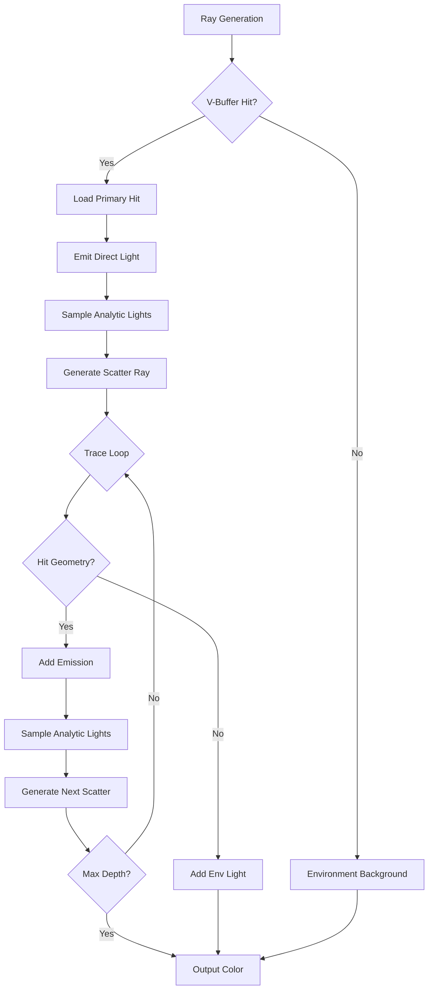
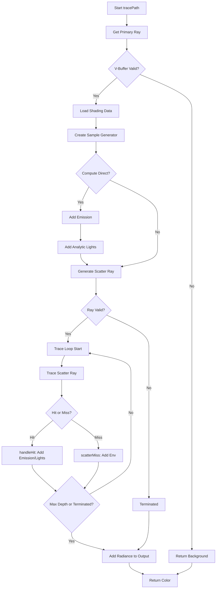

# MinimalPathTracer シェーダー実装解説

本ドキュメントは、[MinimalPathTracer.rt.slang](../Source/RenderPasses/MinimalPathTracer/MinimalPathTracer.rt.slang)のシェーダー実装について詳細に解説します。

## 目次

1. [概要とアーキテクチャ](#概要とアーキテクチャ)
2. [グローバル設定](#グローバル設定)
3. [データ構造](#データ構造)
4. [ヘルパー関数](#ヘルパー関数)
5. [ライティング関数](#ライティング関数)
6. [レイトレーシング関数](#レイトレーシング関数)
7. [メインアルゴリズム](#メインアルゴリズム)
8. [シェーダーエントリーポイント](#シェーダーエントリーポイント)
9. [理論的詳細](#理論的詳細)

---

## 概要とアーキテクチャ

### 設計思想

MinimalPathTracerシェーダーは以下の原則に従います:

1. **シンプルさ**: 検証用途のため、できるだけ単純な実装
2. **ナイーブなアプローチ**: 高度な最適化を避ける
3. **モジュラー性**: ライトタイプごとに有効/無効を切り替え可能

### パストレーシングフロー



---

## グローバル設定

### ホスト定義マクロ (行45-54)

```slang
// The host sets the following defines:
//
// MAX_BOUNCES             Maximum number of indirect bounces (0 means no indirect).
// COMPUTE_DIRECT          Nonzero if direct illumination should be included.
// USE_IMPORTANCE_SAMPLING Nonzero if importance sampling should be used for sampling materials.
// USE_ANALYTIC_LIGHTS     Nonzero if Falcor's analytic lights should be used.
// USE_EMISSIVE_LIGHTS     Nonzero if emissive geometry should be used as lights.
// USE_ENV_LIGHT           Nonzero if env map is available and should be used as light source.
// USE_ENV_BACKGROUND      Nonzero if env map is available and should be used as background.
// is_valid_<name>         1 if optional I/O buffer with this name should be used.
```

これらのマクロはC++側（[MinimalPathTracer.cpp:154-165](../Source/RenderPasses/MinimalPathTracer/MinimalPathTracer.cpp#L154-L165)）で設定されます。

### インポートとインクルード (行57-65)

```slang
#include "Scene/SceneDefines.slangh"
#include "Utils/Math/MathConstants.slangh"

import Scene.Raytracing;
import Scene.Intersection;
import Utils.Math.MathHelpers;
import Utils.Geometry.GeometryHelpers;
import Utils.Sampling.SampleGenerator;
import Rendering.Lights.LightHelpers;
```

#### 役割
- **SceneDefines.slangh**: シーン設定マクロ（ジオメトリタイプなど）
- **MathConstants.slangh**: 数学定数（`FLT_MAX`など）
- **Scene.Raytracing**: レイトレーシングユーティリティ
- **Scene.Intersection**: 交差テスト関数
- **SampleGenerator**: 擬似乱数生成
- **LightHelpers**: ライトサンプリング関数

### 定数バッファ (行67-71)

```slang
cbuffer CB
{
    uint gFrameCount;    // Frame count since scene was loaded.
    uint gPRNGDimension; // First available PRNG dimension.
}
```

#### フィールド
- **gFrameCount**: 乱数シード生成に使用
- **gPRNGDimension**: 他パスとの擬似乱数次元の調整

### 入出力リソース (行73-78)

```slang
// Inputs
Texture2D<PackedHitInfo> gVBuffer;
Texture2D<float4> gViewW; // Optional

// Outputs
RWTexture2D<float4> gOutputColor;
```

#### リソース
- **gVBuffer**: パック済みヒット情報（プライマリレイキャスト結果）
- **gViewW**: ワールド空間ビュー方向（DOF用、オプション）
- **gOutputColor**: 出力カラーバッファ（RGBA32Float）

### 静的設定 (行80-90)

```slang
#define is_valid(name) (is_valid_##name != 0)
static const uint kMaxBounces = MAX_BOUNCES;
static const bool kComputeDirect = COMPUTE_DIRECT;
static const bool kUseImportanceSampling = USE_IMPORTANCE_SAMPLING;
static const bool kUseAnalyticLights = USE_ANALYTIC_LIGHTS;
static const bool kUseEmissiveLights = USE_EMISSIVE_LIGHTS;
static const bool kUseEnvLight = USE_ENV_LIGHT;
static const bool kUseEnvBackground = USE_ENV_BACKGROUND;
static const float3 kDefaultBackgroundColor = float3(0, 0, 0);
static const float kRayTMax = FLT_MAX;
```

マクロを静的定数に変換し、シェーダーコード内で使用しやすくします。

---

## データ構造

### ShadowRayData (行95-98)

```slang
struct ShadowRayData
{
    bool visible;
};
```

#### 役割
シャドウレイのペイロード。最小限の情報のみ保持。

- **visible**: ライトが可視かどうか
  - `false`で初期化
  - ミスシェーダーで`true`に設定
  - Any Hitシェーダーで不透明ジオメトリに遮られた場合は変更なし

### ScatterRayData (行103-127)

```slang
struct ScatterRayData
{
    float3 radiance;  ///< Accumulated outgoing radiance from path.
    bool terminated;  ///< Set to true when path is terminated.
    float3 thp;       ///< Current path throughput. This is updated at each path vertex.
    uint pathLength;  ///< Path length in number of path segments (0 at origin, 1 at first secondary hit, etc.). Max 2^31.
    float3 origin;    ///< Next path segment origin.
    float3 direction; ///< Next path segment direction.

    SampleGenerator sg; ///< Per-ray state for the sample generator (up to 16B).

    __init(SampleGenerator sg)
    {
        this.terminated = false;
        this.pathLength = 0;
        this.radiance = float3(0, 0, 0);
        this.thp = float3(1, 1, 1);
        this.origin = float3(0, 0, 0);
        this.direction = float3(0, 0, 0);
        this.sg = sg;
    }
};
```

#### フィールド詳細

| フィールド | 型 | サイズ | 説明 |
|----------|-----|-------|------|
| radiance | float3 | 12B | 累積放射輝度 |
| terminated | bool | 4B | パス終了フラグ |
| thp | float3 | 12B | パススループット（経路スループット） |
| pathLength | uint | 4B | パス長（0=原点、1=1次反射...） |
| origin | float3 | 12B | 次レイセグメントの原点 |
| direction | float3 | 12B | 次レイセグメントの方向 |
| sg | SampleGenerator | 16B | サンプルジェネレータ状態 |

**合計**: 72バイト（`kMaxPayloadSizeBytes`と一致）

#### 初期化コンストラクタ

```slang
__init(SampleGenerator sg)
```

- スループットを1に初期化（減衰なし状態）
- 放射輝度を0に初期化（累積前）
- 終了フラグをfalse、パス長を0に設定

---

## ヘルパー関数

### loadShadingData (行136-177)

```slang
ShadingData loadShadingData(const HitInfo hit, const float3 rayOrigin, const float3 rayDir)
{
    VertexData v = {};
    uint materialID = {};

#if SCENE_HAS_GEOMETRY_TYPE(GEOMETRY_TYPE_TRIANGLE_MESH)
    if (hit.getType() == HitType::Triangle)
    {
        const TriangleHit triangleHit = hit.getTriangleHit();
        v = gScene.getVertexData(triangleHit);
        materialID = gScene.getMaterialID(triangleHit.instanceID);
    }
#endif
    // ... 他のジオメトリタイプも同様

    ShadingData sd = gScene.materials.prepareShadingData(v, materialID, -rayDir);

    return sd;
}
```

#### 役割
ヒット情報から`ShadingData`を構築します。

#### 処理フロー
1. **ヒットタイプ判定**: `hit.getType()`でジオメトリタイプを取得
2. **頂点データ取得**: 各タイプに応じたデータ取得関数を呼び出し
3. **マテリアルID取得**: インスタンスIDからマテリアルIDを取得
4. **ShadingData準備**: マテリアルシステムで最終的なシェーディングデータを構築

#### 対応ジオメトリタイプ

| タイプ | 条件マクロ | データ取得関数 |
|-------|----------|--------------|
| Triangle | `SCENE_HAS_GEOMETRY_TYPE(GEOMETRY_TYPE_TRIANGLE_MESH)` | `gScene.getVertexData(triangleHit)` |
| DisplacedTriangle | `SCENE_HAS_GEOMETRY_TYPE(GEOMETRY_TYPE_DISPLACED_TRIANGLE_MESH)` | `gScene.getVertexData(displacedTriangleHit, -rayDir)` |
| Curve | `SCENE_HAS_GEOMETRY_TYPE(GEOMETRY_TYPE_CURVE)` | `gScene.getVertexDataFromCurve(curveHit)` |
| SDFGrid | `SCENE_HAS_GEOMETRY_TYPE(GEOMETRY_TYPE_SDF_GRID)` | `gScene.getVertexDataFromSDFGrid(sdfGridHit, rayOrigin, rayDir)` |

### getPrimaryRayDir (行182-196)

```slang
float3 getPrimaryRayDir(uint2 launchIndex, uint2 launchDim, const Camera camera)
{
    if (is_valid(gViewW))
    {
        // If we have the view vector bound as a buffer, just fetch it. No need to compute anything.
        return -gViewW[launchIndex].xyz;
    }
    else
    {
        // Compute the view vector. This must exactly match what the G-buffer pass is doing (jitter etc.).
        // Note that we do not take depth-of-field into account as it would require exactly matching the
        // sample generator between the passes, which is error prone. The host side will issue a warning instead.
        return camera.computeRayPinhole(launchIndex, launchDim).dir;
    }
}
```

#### 役割
プライマリレイの方向を取得します。

#### 2つの方法

1. **gViewWバッファから取得**（優先）:
   - 事前計算されたビュー方向を使用
   - DOF（被写界深度）を正確にサポート
   - `-gViewW[launchIndex].xyz`: 符号反転が必要

2. **ピンホールカメラ計算**（フォールバック）:
   - `camera.computeRayPinhole()`: ジッター等を含む計算
   - DOFは考慮されない（警告がC++側で発行される）

---

## レイトレーシング関数

### traceShadowRay (行205-227)

```slang
bool traceShadowRay(float3 origin, float3 dir, float distance)
{
    RayDesc ray;
    ray.Origin = origin;
    ray.Direction = dir;
    ray.TMin = 0.f;
    ray.TMax = distance;

    ShadowRayData rayData;
    rayData.visible = false; // Set to true by miss shader if ray is not terminated before
    TraceRay(
        gScene.rtAccel,
        RAY_FLAG_ACCEPT_FIRST_HIT_AND_END_SEARCH,
        0xff /* instanceInclusionMask */,
        1 /* hitIdx */,
        rayTypeCount,
        1 /* missIdx */,
        ray,
        rayData
    );

    return rayData.visible;
}
```

#### パラメータ

| パラメータ | 説明 |
|----------|------|
| origin | シャドウレイ原点（シェーディング点） |
| dir | ライトへの方向（正規化済み） |
| distance | ライトまでの距離 |

#### TraceRayパラメータ

| パラメータ | 値 | 説明 |
|----------|-----|------|
| rtAccel | `gScene.rtAccel` | レイトレーシング加速構造 |
| flags | `RAY_FLAG_ACCEPT_FIRST_HIT_AND_END_SEARCH` | 最初のヒットで終了（最適化） |
| mask | `0xff` | 全インスタンスを対象 |
| hitIdx | `1` | シャドウレイ用ヒットグループ（インデックス1） |
| rayTypeCount | `rayTypeCount` | レイタイプ数でストライド |
| missIdx | `1` | シャドウミスシェーダー（インデックス1） |
| ray | `ray` | レイ記述子 |
| payload | `rayData` | ペイロード |

#### 戻り値
- `true`: ライトが可視（何も遮らない）
- `false`: 何かに遮られた

### traceScatterRay (行233-243)

```slang
void traceScatterRay(inout ScatterRayData rayData)
{
    RayDesc ray;
    ray.Origin = rayData.origin;
    ray.Direction = rayData.direction;
    ray.TMin = 0.f;
    ray.TMax = kRayTMax;

    uint rayFlags = 0; // TODO: Set cull mode from the app
    TraceRay(gScene.rtAccel, rayFlags, 0xff /* instanceInclusionMask */, 0 /* hitIdx */, rayTypeCount, 0 /* missIdx */, ray, rayData);
}
```

#### 役割
スキャッターレイ（散乱レイ）をトレースし、ペイロードを更新します。

#### TraceRayパラメータ

| パラメータ | 値 | 説明 |
|----------|-----|------|
| hitIdx | `0` | スキャッターレイ用ヒットグループ |
| missIdx | `0` | スキャッターミスシェーダー |
| TMax | `kRayTMax` | 無限遠（`FLT_MAX`） |

#### ペイロード更新
- ヒット時: `handleHit()`で更新（次の原点/方向、放射輝度累積など）
- ミス時: `scatterMiss()`で終了フラグ設定

---

## ライティング関数

### evalDirectAnalytic (行253-286)

```slang
float3 evalDirectAnalytic(const ShadingData sd, const IMaterialInstance mi, inout SampleGenerator sg)
{
    const uint lightCount = gScene.getLightCount();
    if (lightCount == 0)
        return float3(0.f);

    // Pick one of the analytic light sources randomly with equal probability.
    const uint lightIndex = min(uint(sampleNext1D(sg) * lightCount), lightCount - 1);
    float invPdf = lightCount; // Light selection pdf = 1.0 / lightCount.

    // Sample local light source.
    AnalyticLightSample ls;
    if (!sampleLight(sd.posW, gScene.getLight(lightIndex), sg, ls))
        return float3(0.f);

    // Reject sample if not in the hemisphere of a BSDF lobe.
    const uint lobeTypes = mi.getLobeTypes(sd);
    const bool hasReflection = lobeTypes & uint(LobeType::Reflection);
    const bool hasTransmission = lobeTypes & uint(LobeType::Transmission);
    float NdotL = dot(sd.getOrientedFaceNormal(), ls.dir);
    if ((NdotL <= kMinCosTheta && !hasTransmission) || (NdotL >= -kMinCosTheta && !hasReflection))
        return float3(0.f);

    // Get origin with offset applied in direction of the geometry normal to avoid self-intersection.
    const float3 origin = computeRayOrigin(sd.posW, dot(sd.faceN, ls.dir) >= 0.f ? sd.faceN : -sd.faceN);

    // Test visibility by tracing a shadow ray.
    bool V = traceShadowRay(origin, ls.dir, ls.distance);
    if (!V)
        return float3(0.f);

    // Evaluate contribution.
    return mi.eval(sd, ls.dir, sg) * ls.Li * invPdf;
}
```

#### アルゴリズム

##### 1. ライト選択
```slang
const uint lightIndex = min(uint(sampleNext1D(sg) * lightCount), lightCount - 1);
float invPdf = lightCount;
```

- 一様ランダムに1つのライトを選択
- PDF: $p_{light} = \frac{1}{N_{lights}}$
- 逆PDF: $\frac{1}{p_{light}} = N_{lights}$

##### 2. ライトサンプリング
```slang
AnalyticLightSample ls;
if (!sampleLight(sd.posW, gScene.getLight(lightIndex), sg, ls))
    return float3(0.f);
```

- シェーディング点からライトをサンプル
- `ls.dir`: ライト方向
- `ls.Li`: ライトの入射輝度
- `ls.distance`: ライトまでの距離

##### 3. 半球チェック
```slang
const uint lobeTypes = mi.getLobeTypes(sd);
const bool hasReflection = lobeTypes & uint(LobeType::Reflection);
const bool hasTransmission = lobeTypes & uint(LobeType::Transmission);
float NdotL = dot(sd.getOrientedFaceNormal(), ls.dir);
if ((NdotL <= kMinCosTheta && !hasTransmission) || (NdotL >= -kMinCosTheta && !hasReflection))
    return float3(0.f);
```

ライト方向が適切な半球内にあるかチェック:
- 反射のみ: $N \cdot L > \epsilon$（上半球）
- 透過のみ: $N \cdot L < -\epsilon$（下半球）
- 両方: どちらでも可

##### 4. シャドウレイトレース
```slang
const float3 origin = computeRayOrigin(sd.posW, dot(sd.faceN, ls.dir) >= 0.f ? sd.faceN : -sd.faceN);
bool V = traceShadowRay(origin, ls.dir, ls.distance);
if (!V)
    return float3(0.f);
```

- レイ原点をジオメトリ法線方向にオフセット（自己交差回避）
- 可視性テスト: $V \in \{0, 1\}$

##### 5. 寄与計算
```slang
return mi.eval(sd, ls.dir, sg) * ls.Li * invPdf;
```

直接照明の推定値:
$$
L_{direct} = \frac{f_r(\omega_i, \omega_o) \cdot L_i \cdot V \cdot (N \cdot \omega_i)}{p_{light}} \cdot N_{lights}
$$

- `mi.eval()`: $f_r \cdot (N \cdot \omega_i)$ を返す
- `ls.Li`: 入射輝度 $L_i \cdot V$（可視性込み）
- `invPdf`: $N_{lights}$（逆PDF）

---

## スキャッターレイ生成

### generateScatterRay (行297-314)

```slang
bool generateScatterRay(const ShadingData sd, const IMaterialInstance mi, bool isCurveHit, float3 rayOrigin, inout ScatterRayData rayData)
{
    // Sample material.
    BSDFSample bsdfSample;
    if (mi.sample(sd, rayData.sg, bsdfSample, kUseImportanceSampling))
    {
        rayData.origin = rayOrigin;
        if (!isCurveHit && bsdfSample.isLobe(LobeType::Transmission))
        {
            rayData.origin = sd.computeRayOrigin(false);
        }
        rayData.direction = bsdfSample.wo;
        rayData.thp *= bsdfSample.weight;
        return any(rayData.thp > 0.f);
    }

    return false;
}
```

#### 処理フロー

##### 1. BSDFサンプリング
```slang
BSDFSample bsdfSample;
if (mi.sample(sd, rayData.sg, bsdfSample, kUseImportanceSampling))
```

- マテリアルインスタンスからBSDFサンプルを取得
- `kUseImportanceSampling`: 重点サンプリングフラグ
  - `true`: BRDF/BTDFに基づくサンプリング
  - `false`: 一様半球サンプリング

##### 2. レイ原点設定
```slang
rayData.origin = rayOrigin;
if (!isCurveHit && bsdfSample.isLobe(LobeType::Transmission))
{
    rayData.origin = sd.computeRayOrigin(false);
}
```

- **反射**: 渡された`rayOrigin`を使用
- **透過** (非カーブ): サーフェスの裏側から開始
  - `computeRayOrigin(false)`: 法線の反対方向にオフセット

##### 3. 方向とスループット更新
```slang
rayData.direction = bsdfSample.wo;
rayData.thp *= bsdfSample.weight;
return any(rayData.thp > 0.f);
```

- **方向**: BSDFサンプルの出射方向 $\omega_o$
- **スループット**: 重みを乗算
  $$
  \text{thp}_{new} = \text{thp}_{old} \cdot \frac{f_r(\omega_i, \omega_o) \cdot (N \cdot \omega_i)}{p(\omega_i)}
  $$
- **継続判定**: スループットが0より大きい場合のみ継続

---

## ヒット処理

### handleHit (行324-376)

```slang
void handleHit(const HitInfo hit, inout ScatterRayData rayData)
{
    const bool isCurveHit = hit.getType() == HitType::Curve;

    // Load shading data.
    ShadingData sd = loadShadingData(hit, rayData.origin, rayData.direction);

    // Create material instance.
    let lod = ExplicitLodTextureSampler(0.f);
    let mi = gScene.materials.getMaterialInstance(sd, lod);

    // Add emitted light.
    if (kUseEmissiveLights && (kComputeDirect || rayData.pathLength > 0))
    {
        rayData.radiance += rayData.thp * mi.getProperties(sd).emission;
    }

    // Check whether to terminate based on max depth.
    if (rayData.pathLength >= kMaxBounces)
    {
        rayData.terminated = true;
        return;
    }

    // Compute ray origin for new rays spawned from the hit.
    float3 rayOrigin;
    if (isCurveHit)
    {
        // For curves, we set the new origin at the sphere center.
        rayOrigin = sd.posW - sd.curveRadius * sd.frame.N;
    }
    else
    {
        rayOrigin = sd.computeRayOrigin();
    }

    // Add contribution of direct light from analytic lights.
    if (kUseAnalyticLights)
    {
        float3 Lr = evalDirectAnalytic(sd, mi, rayData.sg);
        rayData.radiance += rayData.thp * Lr;
    }

    // Generate scatter ray for the next path segment.
    // The raygen shader will continue the path based on the returned payload.
    if (!generateScatterRay(sd, mi, isCurveHit, rayOrigin, rayData))
    {
        rayData.terminated = true;
        return;
    }

    rayData.pathLength++;
}
```

#### アルゴリズム詳細

##### 1. シェーディングデータ準備
```slang
const bool isCurveHit = hit.getType() == HitType::Curve;
ShadingData sd = loadShadingData(hit, rayData.origin, rayData.direction);
let lod = ExplicitLodTextureSampler(0.f);
let mi = gScene.materials.getMaterialInstance(sd, lod);
```

- カーブヒット判定（特殊処理が必要）
- シェーディングデータロード
- LOD 0でマテリアルインスタンス作成

##### 2. 発光追加
```slang
if (kUseEmissiveLights && (kComputeDirect || rayData.pathLength > 0))
{
    rayData.radiance += rayData.thp * mi.getProperties(sd).emission;
}
```

条件:
- `kUseEmissiveLights`: 発光マテリアル有効
- `kComputeDirect || rayData.pathLength > 0`: 直接照明有効、または間接バウンス

寄与:
$$
L_{emit} = \text{thp} \cdot L_e
$$

##### 3. 深度チェック
```slang
if (rayData.pathLength >= kMaxBounces)
{
    rayData.terminated = true;
    return;
}
```

最大深度に達した場合、パスを終了。

##### 4. レイ原点計算
```slang
float3 rayOrigin;
if (isCurveHit)
{
    rayOrigin = sd.posW - sd.curveRadius * sd.frame.N;
}
else
{
    rayOrigin = sd.computeRayOrigin();
}
```

- **カーブ**: 球中心を原点に設定
  - `sd.posW - sd.curveRadius * sd.frame.N`: 球面から中心へ戻る
- **その他**: 法線方向にオフセットした点

##### 5. 解析的ライト評価
```slang
if (kUseAnalyticLights)
{
    float3 Lr = evalDirectAnalytic(sd, mi, rayData.sg);
    rayData.radiance += rayData.thp * Lr;
}
```

直接照明を累積:
$$
L_{radiance} += \text{thp} \cdot L_{direct}
$$

##### 6. 次レイ生成
```slang
if (!generateScatterRay(sd, mi, isCurveHit, rayOrigin, rayData))
{
    rayData.terminated = true;
    return;
}
rayData.pathLength++;
```

- BSDFサンプリングで次レイ生成
- 失敗時（吸収など）は終了
- 成功時はパス長をインクリメント

---

## メインアルゴリズム

### tracePath (行392-468)

```slang
float3 tracePath(const uint2 pixel, const uint2 frameDim)
{
    float3 outColor = float3(0.f);

    const float3 primaryRayOrigin = gScene.camera.getPosition();
    const float3 primaryRayDir = getPrimaryRayDir(pixel, frameDim, gScene.camera);

    const HitInfo hit = HitInfo(gVBuffer[pixel]);
    if (hit.isValid())
    {
        // Pixel represents a valid primary hit. Compute its contribution.

        const bool isCurveHit = hit.getType() == HitType::Curve;

        // Load shading data.
        ShadingData sd = loadShadingData(hit, primaryRayOrigin, primaryRayDir);

        // Create material instance at shading point.
        let lod = ExplicitLodTextureSampler(0.f);
        let mi = gScene.materials.getMaterialInstance(sd, lod);

        // Create sample generator.
        SampleGenerator sg = SampleGenerator(pixel, gFrameCount);

        // Advance the generator to the first available dimension.
        // TODO: This is potentially expensive. We may want to store/restore the state from memory if it becomes a problem.
        for (uint i = 0; i < gPRNGDimension; i++)
            sampleNext1D(sg);

        // Compute ray origin for new rays spawned from the G-buffer.
        float3 rayOrigin;
        if (isCurveHit)
        {
            // For curves, we set the new origin at the sphere center.
            rayOrigin = sd.posW - sd.curveRadius * sd.frame.N;
        }
        else
        {
            rayOrigin = sd.computeRayOrigin();
        }

        if (kComputeDirect)
        {
            // Always output directly emitted light, independent of whether emissive materials are treated as light sources or not.
            outColor += mi.getProperties(sd).emission;

            // Add contribution of direct light from analytic lights.
            // Light probe and mesh lights are handled by the scatter ray hit/miss shaders.
            outColor += kUseAnalyticLights ? evalDirectAnalytic(sd, mi, sg) : float3(0.f);
        }

        // Prepare ray payload.
        ScatterRayData rayData = ScatterRayData(sg);

        // Generate scatter ray.
        if (!generateScatterRay(sd, mi, isCurveHit, rayOrigin, rayData))
            rayData.terminated = true;

        // Follow path into the scene and compute its total contribution.
        for (uint depth = 0; depth <= kMaxBounces && !rayData.terminated; depth++)
        {
            // Trace scatter ray. If it hits geometry, the closest hit shader samples
            // direct illumination and generates the next scatter ray.
            traceScatterRay(rayData);
        }

        // Store contribution from scatter ray.
        outColor += rayData.radiance;
    }
    else
    {
        // Background pixel.
        outColor = kUseEnvBackground ? gScene.envMap.eval(primaryRayDir) : kDefaultBackgroundColor;
    }

    return outColor;
}
```

#### アルゴリズムフロー



#### ステップ詳細

##### 1. プライマリレイ取得
```slang
const float3 primaryRayOrigin = gScene.camera.getPosition();
const float3 primaryRayDir = getPrimaryRayDir(pixel, frameDim, gScene.camera);
const HitInfo hit = HitInfo(gVBuffer[pixel]);
```

- カメラ位置を原点に
- V-Bufferからヒット情報をデコード

##### 2. 有効性チェック
```slang
if (hit.isValid())
```

- 無効な場合: 背景色を返す
- 有効な場合: パストレーシング続行

##### 3. サンプルジェネレータ初期化
```slang
SampleGenerator sg = SampleGenerator(pixel, gFrameCount);

for (uint i = 0; i < gPRNGDimension; i++)
    sampleNext1D(sg);
```

- ピクセル座標とフレーム数でシード
- `gPRNGDimension`次元分スキップ（他パスとの調整）

##### 4. 直接照明計算（オプション）
```slang
if (kComputeDirect)
{
    outColor += mi.getProperties(sd).emission;
    outColor += kUseAnalyticLights ? evalDirectAnalytic(sd, mi, sg) : float3(0.f);
}
```

- 発光マテリアルの寄与
- 解析的ライトの寄与

##### 5. 初期スキャッターレイ生成
```slang
ScatterRayData rayData = ScatterRayData(sg);
if (!generateScatterRay(sd, mi, isCurveHit, rayOrigin, rayData))
    rayData.terminated = true;
```

- ペイロード初期化
- 最初の散乱方向を生成

##### 6. パストレーシングループ
```slang
for (uint depth = 0; depth <= kMaxBounces && !rayData.terminated; depth++)
{
    traceScatterRay(rayData);
}
```

- 最大`kMaxBounces`回反復
- `traceScatterRay()`がヒット/ミスシェーダーを呼び出す
- ペイロードが更新される

##### 7. 累積と出力
```slang
outColor += rayData.radiance;
return outColor;
```

- 間接照明寄与を追加
- 最終色を返す

---

## シェーダーエントリーポイント

### ミスシェーダー

#### scatterMiss (行474-486)

```slang
[shader("miss")]
void scatterMiss(inout ScatterRayData rayData)
{
    // Ray missed the scene. Mark the ray as terminated.
    rayData.terminated = true;

    // Add contribution from distant light (env map) in this direction.
    if (kUseEnvLight && (kComputeDirect || rayData.pathLength > 0))
    {
        float3 Le = gScene.envMap.eval(WorldRayDirection());
        rayData.radiance += rayData.thp * Le;
    }
}
```

##### 処理
1. パス終了フラグ設定
2. 環境マップ評価（条件付き）:
   - `kUseEnvLight`: 環境マップライト有効
   - `kComputeDirect || rayData.pathLength > 0`: 直接照明有効、または間接バウンス
3. 放射輝度累積: $L_{radiance} += \text{thp} \cdot L_{env}$

#### shadowMiss (行488-493)

```slang
[shader("miss")]
void shadowMiss(inout ShadowRayData rayData)
{
    // The miss shader is executed if the ray misses all geometry. Mark as visible.
    rayData.visible = true;
}
```

##### 処理
単純に可視性フラグを`true`に設定。

### TriangleMeshヒットグループ

#### scatterTriangleMeshAnyHit (行499-508)

```slang
[shader("anyhit")]
void scatterTriangleMeshAnyHit(inout ScatterRayData rayData, BuiltInTriangleIntersectionAttributes attribs)
{
    // Alpha test for non-opaque geometry.
    GeometryInstanceID instanceID = getGeometryInstanceID();
    VertexData v = getVertexData(instanceID, PrimitiveIndex(), attribs);
    const uint materialID = gScene.getMaterialID(instanceID);
    if (gScene.materials.alphaTest(v, materialID, 0.f))
        IgnoreHit();
}
```

##### 役割
- アルファテスト（透明度テスト）
- `alphaTest()`が`true`を返す場合（透明）: `IgnoreHit()`で交差を無視
- 不透明な場合: Closest Hitシェーダーへ進む

#### scatterTriangleMeshClosestHit (行510-518)

```slang
[shader("closesthit")]
void scatterTriangleMeshClosestHit(inout ScatterRayData rayData, BuiltInTriangleIntersectionAttributes attribs)
{
    TriangleHit triangleHit;
    triangleHit.instanceID = getGeometryInstanceID();
    triangleHit.primitiveIndex = PrimitiveIndex();
    triangleHit.barycentrics = attribs.barycentrics;
    handleHit(HitInfo(triangleHit), rayData);
}
```

##### 処理
1. `TriangleHit`構造体を構築
2. `handleHit()`を呼び出してペイロード更新

#### shadowTriangleMeshAnyHit (行520-529)

```slang
[shader("anyhit")]
void shadowTriangleMeshAnyHit(inout ShadowRayData rayData, BuiltInTriangleIntersectionAttributes attribs)
{
    // Alpha test for non-opaque geometry.
    GeometryInstanceID instanceID = getGeometryInstanceID();
    VertexData v = getVertexData(instanceID, PrimitiveIndex(), attribs);
    const uint materialID = gScene.getMaterialID(instanceID);
    if (gScene.materials.alphaTest(v, materialID, 0.f))
        IgnoreHit();
}
```

##### 役割
スキャッターレイのAny Hitと同じアルファテスト処理。

### DisplacedTriangleMeshヒットグループ

#### displacedTriangleMeshIntersection (行535-545)

```slang
[shader("intersection")]
void displacedTriangleMeshIntersection()
{
    const Ray ray = Ray(WorldRayOrigin(), WorldRayDirection(), RayTMin(), RayTCurrent());
    DisplacedTriangleMeshIntersector::Attribs attribs;
    float t;
    if (DisplacedTriangleMeshIntersector::intersect(ray, getGeometryInstanceID(), PrimitiveIndex(), attribs, t))
    {
        ReportHit(t, 0, attribs);
    }
}
```

##### 処理
1. レイ構築
2. `DisplacedTriangleMeshIntersector::intersect()`で交差テスト
3. 交差した場合: `ReportHit()`で報告

#### scatterDisplacedTriangleMeshClosestHit (行547-556)

```slang
[shader("closesthit")]
void scatterDisplacedTriangleMeshClosestHit(inout ScatterRayData rayData, DisplacedTriangleMeshIntersector::Attribs attribs)
{
    DisplacedTriangleHit displacedTriangleHit;
    displacedTriangleHit.instanceID = getGeometryInstanceID();
    displacedTriangleHit.primitiveIndex = PrimitiveIndex();
    displacedTriangleHit.barycentrics = attribs.barycentrics;
    displacedTriangleHit.displacement = attribs.displacement;
    handleHit(HitInfo(displacedTriangleHit), rayData);
}
```

##### 処理
`DisplacedTriangleHit`構築後、`handleHit()`呼び出し。

### Curveヒットグループ

#### curveIntersection (行562-572)

```slang
[shader("intersection")]
void curveIntersection()
{
    const Ray ray = Ray(WorldRayOrigin(), WorldRayDirection(), RayTMin(), RayTCurrent());
    CurveIntersector::Attribs attribs;
    float t;
    if (CurveIntersector::intersect(ray, getGeometryInstanceID(), PrimitiveIndex(), attribs, t))
    {
        ReportHit(t, 0, attribs);
    }
}
```

##### 処理
カーブ専用交差テスト（球掃引カーブ）。

#### scatterCurveClosestHit (行574-582)

```slang
[shader("closesthit")]
void scatterCurveClosestHit(inout ScatterRayData rayData, CurveIntersector::Attribs attribs)
{
    CurveHit curveHit;
    curveHit.instanceID = getGeometryInstanceID();
    curveHit.primitiveIndex = PrimitiveIndex();
    curveHit.barycentrics = attribs.barycentrics;
    handleHit(HitInfo(curveHit), rayData);
}
```

### SDFGridヒットグループ

#### sdfGridIntersection (行588-598)

```slang
[shader("intersection")]
void sdfGridIntersection()
{
    const Ray ray = Ray(WorldRayOrigin(), WorldRayDirection(), RayTMin(), RayTCurrent());
    SDFGridHitData sdfGridHitData;
    float t;
    if (SDFGridIntersector::intersect(ray, getGeometryInstanceID(), PrimitiveIndex(), sdfGridHitData, t))
    {
        ReportHit(t, 0, sdfGridHitData);
    }
}
```

##### 処理
SDFグリッド用レイマーチング交差テスト。

#### scatterSdfGridClosestHit (行600-607)

```slang
[shader("closesthit")]
void scatterSdfGridClosestHit(inout ScatterRayData rayData, SDFGridHitData sdfGridHitData)
{
    SDFGridHit sdfGridHit;
    sdfGridHit.instanceID = getGeometryInstanceID();
    sdfGridHit.hitData = sdfGridHitData;
    handleHit(HitInfo(sdfGridHit), rayData);
}
```

### レイ生成シェーダー

#### rayGen (行613-622)

```slang
[shader("raygeneration")]
void rayGen()
{
    uint2 pixel = DispatchRaysIndex().xy;
    uint2 frameDim = DispatchRaysDimensions().xy;

    float3 color = tracePath(pixel, frameDim);

    gOutputColor[pixel] = float4(color, 1.f);
}
```

##### 処理
1. ピクセル座標取得
2. フレーム次元取得
3. `tracePath()`でカラー計算
4. 出力バッファに書き込み

---

## 理論的詳細

### モンテカルロパストレーシングの数学

#### レンダリング方程式の再帰形式

パストレーシングは以下の再帰形式を解きます:

$$
L(x_i \to x_{i-1}) = L_e(x_i \to x_{i-1}) + \int_{\mathcal{S}} f_s(x_{i+1} \to x_i \to x_{i-1}) L(x_{i+1} \to x_i) G(x_{i+1} \leftrightarrow x_i) dA(x_{i+1})
$$

記号:
- $L(x_i \to x_{i-1})$: 点$x_i$から$x_{i-1}$への輝度
- $L_e$: 放射輝度（発光）
- $f_s$: BSDF（双方向散乱分布関数）
- $G$: ジオメトリ項（コサイン×可視性/距離²）
- $\mathcal{S}$: 全サーフェス

#### パススループットの再帰

MinimalPathTracerの実装:

$$
\text{thp}_i = \text{thp}_{i-1} \cdot \frac{f_s(x_{i+1} \to x_i \to x_{i-1}) \cdot G(x_{i+1} \leftrightarrow x_i)}{p(x_{i+1}|x_i)}
$$

簡略化（ジオメトリ項がBSDFサンプリングに含まれる場合）:

$$
\text{thp}_i = \text{thp}_{i-1} \cdot \text{weight}_i
$$

where `weight`は`mi.sample()`から返される値。

#### 直接照明の推定

解析的ライト（ポイント、ディレクショナル）の場合:

$$
L_{direct}(x) = \sum_{k=1}^{N_{lights}} \frac{1}{N_{lights}} \cdot f_s(x_k \to x \to \omega_o) \cdot L_k \cdot V(x \leftrightarrow x_k) \cdot G(x \leftrightarrow x_k)
$$

実装では1つのライトをランダムサンプル:

$$
L_{direct}(x) \approx N_{lights} \cdot f_s(\omega_i \to x \to \omega_o) \cdot L_i \cdot V \cdot (N \cdot \omega_i)
$$

### 重点サンプリング vs 一様サンプリング

#### 一様半球サンプリング

PDF:
$$
p(\omega) = \frac{1}{2\pi}
$$

推定値:
$$
L \approx 2\pi \cdot f_s(\omega_i \to x \to \omega_o) \cdot L_i(\omega_i) \cdot (N \cdot \omega_i)
$$

分散:
$$
\text{Var}[L] \propto \int (f_s \cdot L_i \cdot \cos\theta)^2 d\omega - \left(\int f_s \cdot L_i \cdot \cos\theta d\omega\right)^2
$$

#### BRDF重点サンプリング

PDF:
$$
p(\omega) \propto f_s(\omega_i \to x \to \omega_o) \cdot (N \cdot \omega_i)
$$

理想的には:
$$
p(\omega) = \frac{f_s(\omega) \cdot \cos\theta}{\int f_s(\omega') \cdot \cos\theta' d\omega'}
$$

推定値:
$$
L \approx \frac{f_s \cdot L_i \cdot \cos\theta}{p(\omega)}
$$

分散削減:
- 完璧なサンプリング（$p \propto f_s \cdot L_i \cdot \cos\theta$）なら分散0
- BRDF比例サンプリングでも大幅に分散削減

### 不偏性の証明

MinimalPathTracerの推定値$\hat{L}$は不偏:

$$
\mathbb{E}[\hat{L}] = L
$$

証明:

直接照明部分:
$$
\mathbb{E}[L_{direct}] = \mathbb{E}\left[\frac{f_s \cdot L_i \cdot V \cdot \cos\theta}{p(\omega)}\right] = \int \frac{f_s \cdot L_i \cdot V \cdot \cos\theta}{p(\omega)} \cdot p(\omega) d\omega = \int f_s \cdot L_i \cdot V \cdot \cos\theta d\omega
$$

間接照明部分（再帰）:
$$
\mathbb{E}[L_{indirect}] = \mathbb{E}\left[\frac{f_s \cdot L(\omega_i) \cdot \cos\theta}{p(\omega)}\right] = \int \frac{f_s \cdot L(\omega_i) \cdot \cos\theta}{p(\omega)} \cdot p(\omega) d\omega = \int f_s \cdot L(\omega_i) \cdot \cos\theta d\omega
$$

ライト選択:
$$
\mathbb{E}[L_{light}] = \sum_{k} P(k) \cdot \frac{L_k}{P(k)} = \sum_{k} L_k
$$

### 自己交差回避

#### レイ原点オフセット

```slang
const float3 origin = computeRayOrigin(sd.posW, normalDirection);
```

実装（概念的）:
$$
\text{origin} = \text{posW} + \epsilon \cdot \text{normalDirection}
$$

$\epsilon$の選択:
- 浮動小数点精度を考慮
- シーンスケールに依存
- 通常: $\epsilon \approx 10^{-4}$ ～ $10^{-3}$

#### カーブの特殊処理

```slang
if (isCurveHit)
{
    rayOrigin = sd.posW - sd.curveRadius * sd.frame.N;
}
```

カーブは球掃引として扱われるため、球中心から新しいレイを開始。

### ペイロードサイズ最適化

#### ScatterRayData: 72バイト内訳

```
radiance:   3 * 4B = 12B (float3)
terminated: 4B        (bool, パディング込み)
thp:        3 * 4B = 12B (float3)
pathLength: 4B        (uint)
origin:     3 * 4B = 12B (float3)
direction:  3 * 4B = 12B (float3)
sg:         16B       (SampleGenerator state)
-----------------------------------
合計:       72B
```

なぜ72バイト?
- GPU性能: 小さいペイロード = 小さいトラバーサルスタック
- トレードオフ: 情報量 vs メモリ/性能

### シェーダーバインディングテーブル（SBT）構造

#### レイアウト

```
Ray Types: [Scatter(0), Shadow(1)]
Miss Shaders: [scatterMiss(0), shadowMiss(1)]

Hit Groups:
  TriangleMesh:
    [0] Scatter: (ClosestHit: scatterTriangleMeshClosestHit, AnyHit: scatterTriangleMeshAnyHit)
    [1] Shadow:  (AnyHit: shadowTriangleMeshAnyHit)

  DisplacedTriangleMesh:
    [0] Scatter: (ClosestHit: scatterDisplacedTriangleMeshClosestHit, Intersection: displacedTriangleMeshIntersection)
    [1] Shadow:  (Intersection: displacedTriangleMeshIntersection)

  Curve:
    [0] Scatter: (ClosestHit: scatterCurveClosestHit, Intersection: curveIntersection)
    [1] Shadow:  (Intersection: curveIntersection)

  SDFGrid:
    [0] Scatter: (ClosestHit: scatterSdfGridClosestHit, Intersection: sdfGridIntersection)
    [1] Shadow:  (Intersection: sdfGridIntersection)
```

#### アクセスパターン

レイタイプ$r$、ジオメトリインデックス$g$のヒットグループ:
$$
\text{HitGroupIndex} = r \cdot \text{rayTypeCount} + g
$$

---

## まとめ

### シェーダーアーキテクチャ

1. **モジュラー設計**: ライトタイプ、ジオメトリタイプごとに分離
2. **コンパイル時特殊化**: ホスト定義マクロで最適化
3. **ペイロード効率**: 72バイトに収めた設計

### アルゴリズム特性

1. **不偏推定**: 一貫性のある結果保証
2. **柔軟性**: 重点サンプリングのオン/オフ
3. **シンプルさ**: 高度な最適化なし（検証用途）

### 対応機能

| 機能 | 対応状況 |
|-----|---------|
| 解析的ライト | ✓ |
| 発光マテリアル | ✓ |
| 環境マップ | ✓ |
| 重点サンプリング | ✓（オプション） |
| 複数ジオメトリタイプ | ✓ |
| 透過マテリアル | ✗ |
| ネスト誘電体 | ✗ |

### 性能考察

- **収束速度**: 遅い（ブルートフォース）
- **品質**: 高い（不偏推定）
- **メモリ**: 効率的（小ペイロード）

このドキュメントは、MinimalPathTracerのシェーダー実装を数学的背景とともに詳細に解説しました。
