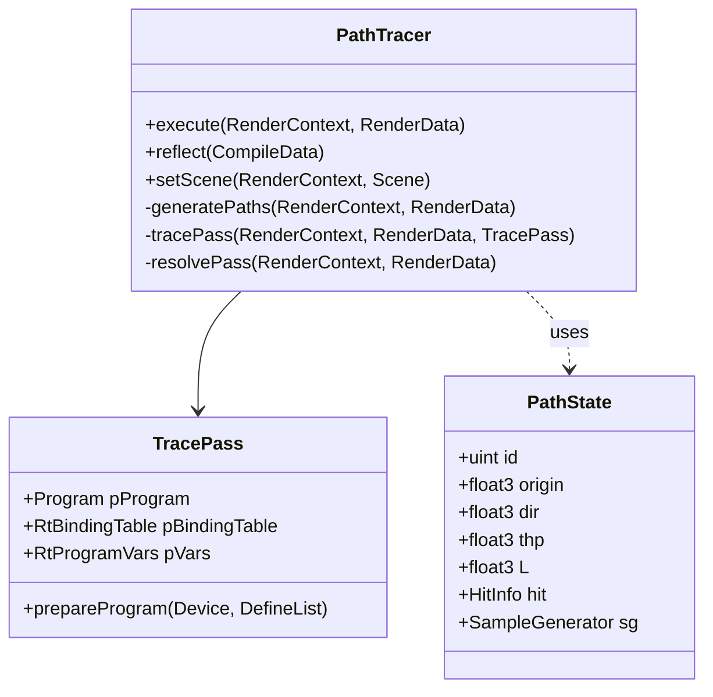
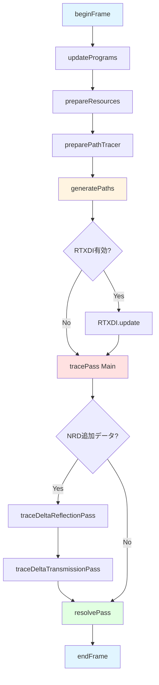

# PathTracer レンダーパス技術ドキュメント

## 概要

PathTracerは、Falcorフレームワークにおけるリファレンス実装のパストレーサーレンダーパスです。DirectX 12とVulkanをサポートし、レイトレーシングを用いた物理ベースのグローバルイルミネーション計算を実行します。

**主要機能:**
- レイトレーシングベースのパストレーシング
- 複数のライトサンプリング手法（NEE、MIS、RTXDI）
- デノイザー用ガイドデータの生成（NRD対応）
- Shader Execution Reordering (SER) による最適化
- Russian Roulette による早期パス終了

## アーキテクチャ

### クラス構造



### 主要コンポーネント

#### 1. PathTracer (C++側)
レンダーパスの制御を担当するホスト側のクラスです。

**ファイル:** [PathTracer.cpp](Source/RenderPasses/PathTracer/PathTracer.cpp), [PathTracer.h](Source/RenderPasses/PathTracer/PathTracer.h)

**主要な責務:**
- シェーダープログラムの管理と特殊化
- ライトサンプラーの初期化（EnvMapSampler、EmissiveLightSampler、RTXDI）
- リソース割り当て（サンプルバッファ、出力テクスチャ）
- レンダリングパスの実行フロー制御

#### 2. TracePass (レイトレーシングパス)
レイトレーシングシェーダーの実行を担当します。

**ファイル:** [TracePass.rt.slang](Source/RenderPasses/PathTracer/TracePass.rt.slang)

**シェーダータイプ:**
- Ray Generation Shader: `rayGen()` - ピクセルごとにパスをトレース
- Closest Hit Shader: `scatterTriangleClosestHit()` など - ヒット処理
- Any Hit Shader: `scatterTriangleAnyHit()` - アルファテスト
- Miss Shader: `scatterMiss()` - ミス処理

#### 3. PathState (パス状態管理)
各パスの状態を保持する構造体です。

**ファイル:** [PathState.slang](Source/RenderPasses/PathTracer/PathState.slang)

**主要なフィールド:**
- `origin`, `dir`: レイの原点と方向
- `thp`: パススループット（累積重み）
- `L`: 累積放射輝度
- `hit`: ヒット情報
- `sg`: サンプルジェネレータ
- `bounceCounters`: バウンス回数カウンタ（拡散/鏡面/透過別）

## レンダリングフロー



### フェーズ詳細

#### Phase 1: 初期化 (beginFrame)
- フレームサイズの設定
- ライティング情報の更新
- RTXDIの準備
- 出力フラグの決定（ガイドデータ、NRDデータなど）

**実装箇所:** [PathTracer.cpp:1132](Source/RenderPasses/PathTracer/PathTracer.cpp#L1132)

#### Phase 2: パス生成 (generatePaths)
プライマリヒットからパスの初期状態を生成します。

**処理内容:**
1. カメラレイの計算
2. V-bufferからプライマリヒット情報のロード
3. サンプルジェネレータの初期化
4. パス状態の初期化

**実装箇所:**
- CPU側: [PathTracer.cpp:1286](Source/RenderPasses/PathTracer/PathTracer.cpp#L1286)
- GPU側: [GeneratePaths.cs.slang](Source/RenderPasses/PathTracer/GeneratePaths.cs.slang)
- パス生成ロジック: [PathTracer.slang:273](Source/RenderPasses/PathTracer/PathTracer.slang#L273)

#### Phase 3: パストレーシング (tracePass)
各パスをトレースして放射輝度を累積します。

**主要なループ構造:**
```slang
while (path.isActive()) {
    // 次のヒットを探索
    path.incrementVertexIndex();
    TraceRay(...);

    // ヒット処理またはミス処理
    if (hitObject.IsHit()) {
        handleHit(path);
    } else {
        handleMiss(path);
    }
}
```

**実装箇所:** [TracePass.rt.slang:244](Source/RenderPasses/PathTracer/TracePass.rt.slang#L244) (ReorderingScheduler), [TracePass.rt.slang:450](Source/RenderPasses/PathTracer/TracePass.rt.slang#L450) (Scheduler)

#### Phase 4: 解決 (resolvePass)
複数サンプルの平均化とガイドデータの集約を行います。

**処理内容:**
- ピクセルごとにサンプルを反復
- カラー値の平均化
- NRDデータの集約（拡散/鏡面の分離など）

**実装箇所:** [PathTracer.cpp:1345](Source/RenderPasses/PathTracer/PathTracer.cpp#L1345)

## 使用技術とアルゴリズム

### 1. Next-Event Estimation (NEE)

各パス頂点で明示的にライトをサンプリングし、シャドウレイを飛ばして直接照明を評価します。

**実装:**
```slang
// ライトサンプリング
bool generateLightSample(PathVertex vertex, ...) {
    // ライトタイプを選択（環境マップ/放射ジオメトリ/解析的ライト）
    selectLightType(...);

    // 選択したライトタイプに応じてサンプリング
    if (lightType == EnvMap) generateEnvMapSample(...);
    else if (lightType == Emissive) generateEmissiveSample(...);
    else if (lightType == Analytic) generateAnalyticLightSample(...);

    // 可視性テスト
    bool visible = traceVisibilityRay(ray);
    if (visible) addToPathContribution(path, Li * weight);
}
```

**実装箇所:** [PathTracer.slang:705](Source/RenderPasses/PathTracer/PathTracer.slang#L705)

**長所:**
- 低ノイズの直接照明
- 小さなライトソースにも有効

**短所:**
- デルタBRDFには適用不可
- 追加のレイトレーシングコスト

### 2. Multiple Importance Sampling (MIS)

BSDFサンプリングとライトサンプリングを組み合わせ、バイアスを軽減します。

**サポートされるヒューリスティック:**
- Balance heuristic: $w_i = \frac{n_i p_i}{\sum_j n_j p_j}$
- Power heuristic (exponent=2): $w_i = \frac{(n_i p_i)^2}{\sum_j (n_j p_j)^2}$
- Power heuristic (可変指数): $w_i = \frac{(n_i p_i)^\beta}{\sum_j (n_j p_j)^\beta}$

**実装箇所:** [PathTracer.slang:522](Source/RenderPasses/PathTracer/PathTracer.slang#L522)

**適用例:**
```slang
// ヒット時のMIS重み計算（BRDF sampling）
if (kUseMIS && isTriangleHit && !isPrimaryHit) {
    float lightPdf = emissiveSampler.evalPdf(...);
    float misWeight = evalMIS(1, path.pdf, 1, lightPdf);
    radiance *= misWeight;
}

// NEE時のMIS重み計算（Light sampling）
if (kUseMIS && ls.lightType != Analytic) {
    float scatterPdf = mi.evalPdf(sd, ls.dir, ...);
    ls.Li *= evalMIS(1, ls.pdf, 1, scatterPdf);
}
```

### 3. BSDF Importance Sampling

マテリアルのBRDF/BTDFに基づいてscatter方向をサンプリングします。

**サポートされるローブタイプ:**
- Diffuse Reflection
- Specular Reflection
- Delta Reflection (完全鏡面)
- Diffuse Transmission
- Specular Transmission
- Delta Transmission (完全透過)

**実装フロー:**
```slang
bool generateScatterRay(ShadingData sd, IMaterialInstance mi, inout PathState path) {
    // BSDFサンプリング
    BSDFSample result;
    mi.sample(sd, path.sg, result, kUseBSDFSampling);

    // スキャッタレイの設定
    path.dir = result.wo;
    path.thp *= result.weight;
    path.pdf = result.pdf;

    // バウンスカウンタの更新
    if (result.isLobe(LobeType::Reflection)) {
        if (isDiffuse) path.incrementBounces(BounceType::Diffuse);
        else path.incrementBounces(BounceType::Specular);
    }
    else if (result.isLobe(LobeType::Transmission)) {
        path.incrementBounces(BounceType::Transmission);
        // 内部リストの更新
        path.interiorList.handleIntersection(...);
    }
}
```

**実装箇所:** [PathTracer.slang:385](Source/RenderPasses/PathTracer/PathTracer.slang#L385)

### 4. Russian Roulette

パススループットに基づいて確率的にパスを終了し、計算コストを削減します。

**アルゴリズム:**
```slang
bool terminatePathByRussianRoulette(inout PathState path, float u) {
    float survivalProb = max(0.f, 1.f - luminance(path.thp));
    if (u < survivalProb) {
        path.terminate();
        return true;
    }
    path.thp /= (1.f - survivalProb);  // 不偏推定量を維持
    return false;
}
```

**実装箇所:** [PathTracer.slang:780](Source/RenderPasses/PathTracer/PathTracer.slang#L780)

**原理:**
Russian Rouletteは、低スループットのパスを確率的に終了することで計算を節約しつつ、生き残ったパスのスループットを補正することで推定量の不偏性を保ちます。

### 5. Shader Execution Reordering (SER)

NVIDIA RTX GPUの機能を利用して、レイトレーシングワークロードのコヒーレンスを改善します。

**仕組み:**
- HitObjectを使用してレイトレーシングとシェーディングを分離
- マテリアルタイプやヒット状態に基づいてスレッドを並び替え
- 類似のコードパスを実行するスレッドをグループ化

**実装構造:**
```slang
struct ReorderingScheduler {
    void tracePath(uint pathID) {
        // パス生成
        generatePath(pathID, path);

        // プライマリヒットの処理
        PathPayload payload = PathPayload::pack(path);
        HitObject::Invoke(gScene.rtAccel, hitObject, payload);

        // パスループ
        while (path.isActive()) {
            // レイトレーシング
            hitObject = HitObject::TraceRay(...);

            // コヒーレンスヒントの計算
            uint hints = getCoherenceHints(path, ...);

            // スレッドの並び替えとシェーダー実行
            ReorderThread(hitObject, hints, 4);
            HitObject::Invoke(gScene.rtAccel, hitObject, payload);
        }
    }
}
```

**実装箇所:** [TracePass.rt.slang:195](Source/RenderPasses/PathTracer/TracePass.rt.slang#L195)

**コヒーレンスヒント:** [PathTracer.slang:320](Source/RenderPasses/PathTracer/PathTracer.slang#L320)
- Russian Rouletteによる終了予測
- バウンス制限による終了予測
- ライトサンプリングの有無
- 放射の計算の有無

### 6. RTXDI (ReSTIR DI)

プライマリヒットでの直接照明をより効率的にサンプリングするための時空間的リサンプリング手法です。

**特徴:**
- 多数のライトソースがあるシーンで有効
- 時間的・空間的なサンプル再利用
- プライマリヒットでのみ使用（spp=1を推奨）

**統合方法:**
```slang
if (applyRTXDI && isPrimaryHit) {
    // RTXDIから最終サンプルを取得
    bool validSample = gRTXDI.getFinalSample(pixel, ls.dir, ls.distance, ls.Li);
    // 通常のNEEと同じ評価フロー
    float3 weight = mi.eval(sd, ls.dir, sg);
    if (traceVisibilityRay(ray)) {
        addToPathContribution(path, weight * ls.Li);
    }
}
```

**実装箇所:** [PathTracer.slang:954](Source/RenderPasses/PathTracer/PathTracer.slang#L954)

### 7. Emissive Light Sampling

シーン内の放射ジオメトリをサンプリングするための複数の手法をサポートします。

**サンプラータイプ:**

#### Uniform Sampler
全ての放射三角形を均等な確率でサンプリングします。シンプルですが、非効率的です。

#### Light BVH Sampler
放射三角形を階層的にクラスタリングし、重要度に基づいてサンプリングします。

**特徴:**
- フラックスベースの重要度サンプリング
- 階層的なBVH構造
- 大量の放射ジオメトリに対応

#### Power Sampler
放射パワーに比例した確率で三角形をサンプリングします。

**実装箇所:** [PathTracer.slang:585](Source/RenderPasses/PathTracer/PathTracer.slang#L585)

### 8. Nested Dielectrics

複数の誘電体が入れ子になっている場合の屈折率計算を処理します。

**Interior List:**
- マテリアル優先度に基づいたスタック管理
- 偽交差の検出と拒否
- 適切なIoRの計算

**実装:**
```slang
bool handleNestedDielectrics(inout ShadingData sd, inout PathState path) {
    uint priority = sd.mtl.getNestedPriority();

    // 偽交差のチェック
    if (!path.interiorList.isTrueIntersection(priority)) {
        path.rejectedHits++;
        path.interiorList.handleIntersection(sd.materialID, priority, sd.frontFacing);
        path.origin = sd.computeRayOrigin(false);
        return false;  // ヒットを拒否
    }

    // 外側の屈折率を計算
    sd.IoR = computeOutsideIoR(path.interiorList, sd.materialID, sd.frontFacing);
    return true;
}
```

**実装箇所:** [PathTracer.slang:743](Source/RenderPasses/PathTracer/PathTracer.slang#L743)

### 9. NRD (NVIDIA Real-time Denoisers) サポート

デノイザーに必要なガイドデータとデモジュレートされた放射輝度を出力します。

**出力データ:**
- **Diffuse Radiance & Hit Distance:** 拡散成分の放射輝度とヒット距離
- **Specular Radiance & Hit Distance:** 鏡面成分の放射輝度とヒット距離
- **Emission:** プライマリサーフェスの自己放射
- **Reflectance:** 拡散・鏡面反射率
- **Delta Reflection/Transmission (追加データ):** デルタイベントの専用データ
- **Residual:** その他のパスタイプ

**デモジュレーション:**
```
デモジュレート放射輝度 = 実際の放射輝度 / 反射率
```

これによりデノイザーは低周波成分（反射率）と高周波成分（照明）を分離して処理できます。

**実装箇所:** [NRDHelpers.slang](Source/RenderPasses/PathTracer/NRDHelpers.slang)

## パラメータ設定

### 静的パラメータ (シェーダー再コンパイル必要)

| パラメータ | デフォルト値 | 説明 |
|-----------|------------|------|
| `samplesPerPixel` | 1 | ピクセルあたりのサンプル数 (1-16) |
| `maxSurfaceBounces` | 0 (自動) | 最大サーフェスバウンス数 |
| `maxDiffuseBounces` | 3 | 最大拡散反射バウンス数 |
| `maxSpecularBounces` | 3 | 最大鏡面反射バウンス数 |
| `maxTransmissionBounces` | 10 | 最大透過バウンス数 |
| `sampleGenerator` | TinyUniform | 疑似乱数生成器タイプ |
| `useBSDFSampling` | true | BRDF重点サンプリングを使用 |
| `useRussianRoulette` | false | Russian Rouletteによる早期終了 |
| `useNEE` | true | Next-Event Estimationを使用 |
| `useMIS` | true | Multiple Importance Samplingを使用 |
| `emissiveSampler` | LightBVH | 放射ライトサンプラータイプ |
| `useRTXDI` | false | RTXDIを使用 |
| `useAlphaTest` | true | 非不透明三角形でアルファテスト |
| `adjustShadingNormals` | false | セカンダリヒットでシェーディング法線調整 |
| `useSER` | true | Shader Execution Reorderingを使用 |
| `colorFormat` | LogLuvHDR | 内部カラーバッファのフォーマット |
| `useNRDDemodulation` | true | NRDデモジュレーションを使用 |

### 動的パラメータ (ランタイム変更可能)

| パラメータ | デフォルト値 | 説明 |
|-----------|------------|------|
| `specularRoughnessThreshold` | 0.25 | 鏡面/拡散分類の粗さ閾値 |
| `lodBias` | 0.0 | テクスチャLODバイアス |
| `useFixedSeed` | false | 固定乱数シードを使用（デバッグ用） |
| `fixedSeed` | 1 | 固定シード値 |

## パフォーマンス考慮事項

### バウンス数の設定
- **低バウンス (1-3):** 高速だがエネルギー損失が大きい
- **中バウンス (3-5):** バランスの取れた設定（推奨）
- **高バウンス (>5):** 物理的に正確だが計算コストが高い

### サンプル数
- **1 spp:** リアルタイム用、デノイザー必須
- **2-4 spp:** インタラクティブプレビュー
- **8-16 spp:** 高品質レンダリング

### SER (Shader Execution Reordering)
- RTX 40シリーズ以降で有効
- 複雑なシーン（多様なマテリアル）で最大2倍の性能向上
- 単純なシーンでは効果が限定的

### RTXDI
- 多数のライトソース (>100) があるシーンで有効
- spp=1での使用を推奨
- プライマリヒットのみに適用

## 入出力

### 入力

| 名前 | 型 | 説明 | 必須 |
|------|---|------|------|
| `vbuffer` | Texture2D&lt;PackedHitInfo&gt; | V-buffer（プライマリヒット情報） | ✓ |
| `mvec` | Texture2D&lt;float2&gt; | モーションベクター | |
| `viewW` | Texture2D&lt;float3&gt; | ワールド空間ビュー方向（DoF用） | |
| `sampleCount` | Texture2D&lt;uint&gt; | 可変サンプル数バッファ | |

### 出力

| 名前 | 型 | 説明 |
|------|---|------|
| `color` | RWTexture2D&lt;float4&gt; | 出力カラー（線形） |
| `albedo` | RWTexture2D&lt;float4&gt; | アルベド（ガイドデータ） |
| `specularAlbedo` | RWTexture2D&lt;float4&gt; | 鏡面アルベド |
| `indirectAlbedo` | RWTexture2D&lt;float4&gt; | 間接アルベド |
| `guideNormal` | RWTexture2D&lt;float4&gt; | ガイド法線 |
| `reflectionPosW` | RWTexture2D&lt;float4&gt; | 反射位置 |
| `rayCount` | RWTexture2D&lt;uint&gt; | レイカウント統計 |
| `pathLength` | RWTexture2D&lt;uint&gt; | パス長統計 |

**NRD出力:**
- `nrdDiffuseRadianceHitDist`
- `nrdSpecularRadianceHitDist`
- `nrdEmission`
- `nrdDiffuseReflectance`
- `nrdSpecularReflectance`
- その他デルタパス用の追加出力

## 制限事項と既知の問題

1. **カスタムプリミティブ非対応:** カスタムジオメトリタイプはサポートされていません
2. **最大バウンス数:** 各バウンスタイプは254バウンスまで
3. **最大フレーム解像度:** 4096x4096ピクセル
4. **最大サンプル数:** 16 spp（タイリングで拡張可能）
5. **SER要件:** RTX 40シリーズ以降のGPU
6. **Shader Model要件:** SM 6.5以上
7. **レイトレーシング要件:** DXR Tier 1.1以上

## 参考文献

- Veach, E. (1997). Robust Monte Carlo Methods for Light Transport Simulation. PhD thesis, Stanford University.
- Pharr, M., Jakob, W., & Humphreys, G. (2016). Physically Based Rendering: From Theory to Implementation (3rd ed.).
- Bitterli, B., et al. (2020). Spatiotemporal reservoir resampling for real-time ray tracing with dynamic direct lighting. ACM Transactions on Graphics (TOG), 39(4).
